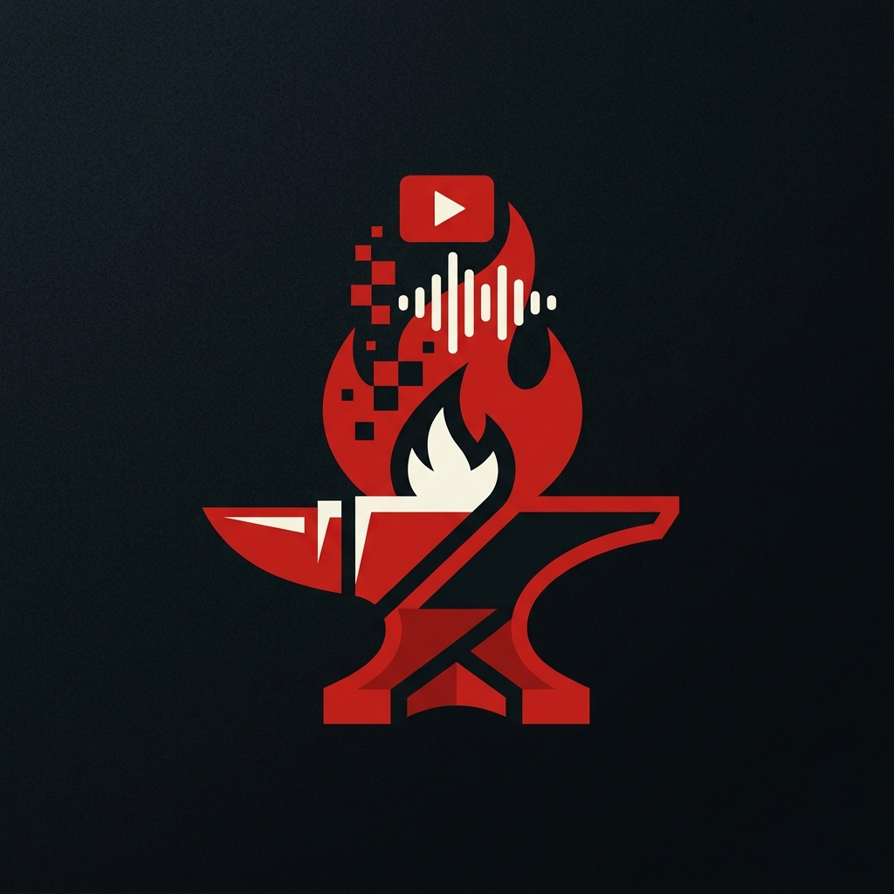

<div align="center">
  
  <h1>StegoForge</h1>
  <p><b>Multimedia Studio untuk Kompresi & Steganografi Berbasis Web</b></p>
  
  [](#)
  [](#)
  [](#)
  [](#)
</div>

<br/>

## 📖 Tentang Proyek

**StegoForge** adalah platform pemrosesan multimedia modern yang berjalan 100% di sisi klien (browser). Proyek ini dikembangkan sebagai pemenuhan tugas **UAS Capstone Project Multimedia** di UIN Sunan Gunung Djati Bandung.

Aplikasi ini menyediakan antarmuka *glassmorphism* premium untuk melakukan operasi kompresi, dekompresi, dan steganografi (penyisipan pesan rahasia) ke dalam berbagai jenis format media (Gambar, Audio, Video). Semuanya dieksekusi secara lokal demi menjaga keamanan dan privasi data pengguna sepenuhnya.

---

## ✨ Fitur Unggulan

### 🖼️ Modul Gambar (Image Codec & Steganography)
* **Kompresi:** Mengecilkan ukuran file gambar dan konversi antar format (JPEG, PNG, WebP) via Canvas API.
* **Dekompresi:** Konversi kembali format lossy ke format lossless (PNG).
* **Encode Steganografi:** Menyisipkan pesan teks rahasia ke dalam bit terendah (LSB) *channel* piksel warna merah tanpa mengubah kualitas visual.
* **Decode Steganografi:** Mengekstraksi pesan tersembunyi dari gambar PNG hasil steganografi.

### 🎵 Modul Audio (Audio Codec & Steganography)
* **Kompresi:** Konversi audio (WAV) ke format MP3, AAC, atau OGG menggunakan modul FFmpeg dengan kontrol manual atas parameter Bitrate dan Sample Rate.
* **Dekompresi:** Merestorasi audio menjadi format file Lossless WAV (PCM 16-bit).
* **Encode/Decode Stego:** Memodifikasi bit sampel *Least Significant Bit* (LSB) pada file PCM WAV murni untuk menyembunyikan untaian teks tanpa gangguan suara (noise) yang terdengar.

### 🎬 Modul Video (Video Codec)
* **Kompresi:** Memanfaatkan FFmpeg WebAssembly untuk merekayasa profil video (re-encode ke H.264 MP4 atau VP9 WebM) dengan dukungan optimasi preset FFmpeg (`ultrafast` hingga `slow`) serta penyesuaian resolusi.
* **Dekompresi:** Konversi video MP4/WebM menjadi format raw tanpa kompresi menggunakan codec Huffyuv di dalam kontainer AVI.

---

## 🛠️ Teknologi yang Digunakan

* **Framework Core:** [Next.js 16 (App Router)](https://nextjs.org/)
* **Bahasa Pemrograman:** [TypeScript](https://www.typescriptlang.org/)
* **UI/UX & Styling:** [Tailwind CSS v4](https://tailwindcss.com/) dengan teknik desain Glassmorphism.
* **Multimedia Processing:** Web Canvas API, Web Audio API, [`@ffmpeg/ffmpeg`](https://ffmpegwasm.netlify.app/) (Porting WebAssembly dari modul C FFmpeg).
* **Iconography:** [Lucide React](https://lucide.dev/)

---

## 🚀 Instalasi & Cara Menjalankan

Pastikan sistem operasi Anda telah terpasang perangkat **Node.js** (versi 18 ke atas sangat direkomendasikan).

1. **Clone Repositori:**
   ```bash
   git clone https://github.com/hilmanmaulana1237/multimedia-uas.git
   cd multimedia-uas/project
   ```

2. **Instal Dependensi NPM:**
   ```bash
   npm install
   ```

3. **Jalankan Server Development:**
   ```bash
   npm run dev
   ```

4. **Akses Browser:**
   Buka peramban modern pilihan Anda menuju `http://localhost:3000`. 
   > **Catatan:** Pastikan Anda memakai browser mutakhir (seperti Chrome, Edge, Safari terbaru). Aplikasi ini mensyaratkan dukungan konfigurasi header *SharedArrayBuffer* (COOP/COEP) yang sudah disetel secara bawaan guna memampukan komputasi berat FFmpeg WebAssembly.

---

## 👨‍💻 Tim Pengembang

Proyek kolaboratif ini dibangun dan dirancang oleh mahasiswa program studi **Informatika - Kelas 6B, UIN Sunan Gunung Djati Bandung**:

| Nama Lengkap | NIM | Peran Utama |
|--------------|:---:|-------------|
| **Hilman Maulana** | `1237050020` | Fullstack Developer, Arsitek Infrastruktur FFmpeg & Logika Codec Steganografi |
| **Mochamad Fahmi Rizieq** | `1237050074` | UI/UX Designer, Tim Penguji QA (*Quality Assurance*) & Peneliti Multimedia |

<br/>
<div align="center">
  <sub>Dibuat dengan ❤️ di Bandung, Indonesia.</sub>
</div>
